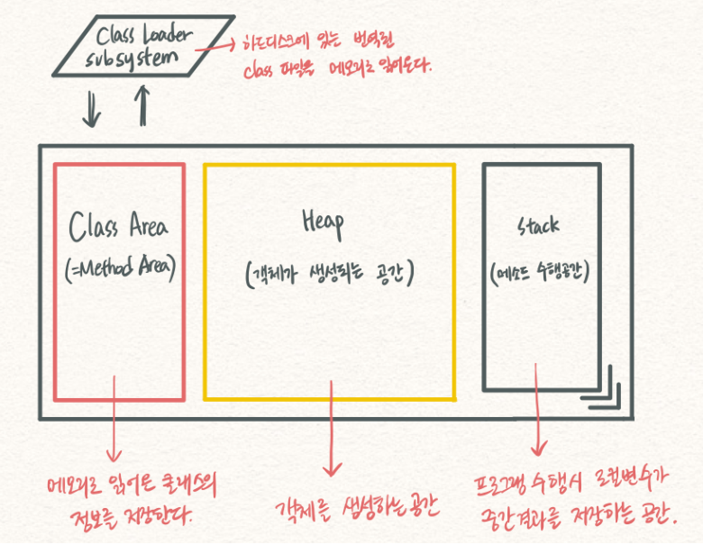

- Table of Contents
{:toc .large-only}

## JAVA

객체 지향 프로그래밍 OOP 
프로그램을 수많은 '객체(object)'라는 
기본단위로 나누고 이들의 상호작용으로 
서술하는 방식이다. 코드 재사용을  
증가시키고, 유지보수를 감소시킨다.

요소 
-캡슐화(encapsulation) 
 정보은닉 프로그램의 세부구현을 외부로 
 드러나지 않도록 특정 모듈을 
 내부로 감추는것.

-상속 
 자식클래스가 부모 클래스의 특성과  
 기능을 그대로 물려 받는것

-다형성 
 하나의 변수나 함수가 상황에 따라  
 다른 의미로 해석될 수 있는 것 
 오버라이딩 자식클래스에서 재정의
 조건 : 메소드 이름, 리턴타입,  
 매개변수의 개수와 데이터 타입, 순서 
 오버로딩 같은 클래스에서 메소드명이 
 같지만 서로다른 매개변수의 형식을 
 갖고 있는 형식

-추상화 
 목적과 관련 없는 부분을 제거하여 
 필요한 부분만을 표현하기 위한 개념 
 객제들의 공통된 특징을 파악해 정의한것.

static 정적멤버 메모리 공간할당시 따로할당 
객체 생성없이 공용적인 데이터라면  
staric으로 선언. 선언시 인스턴스 필드, 
메소드를 내부에서 사용 불가 

클래스는 객체를 만들기위한 틀 
인스턴스는 new 연산자로 메모리에 객체가 
할당되어 실제 메모리를 차지 하는 것.

추상 클래스 
추상메소드를 하나 이상 가진 클래스 
자식클래스에서 반드시 오버라이딩하여  
사용해야 한다. 단일상속

인터페이스 
모든 메소드가 구현부 없는 추상메소드로 
이루어진 클래스 다중구현

차이점은? 목적이 다르다. 추상클래스는 
추상메서드를 자식클래스에서 구체화해서 
기능확장에 목적 
인터페이스는 서로 연관없는 클래스에서 
공통적으로 사용하는 방식이 필요하지만 
기능은 각각 구현해야 할때.

접근 제한자 
public 접근 제한자: 외부 클래스가 
자유롭게 사용할 수 있도록 합니다. 
protected 접근 제한자: 같은 패키지 또는 
자식 클래스에서 사용할 수 있도록 합니다. 
default 접근 제한: 같은 패키지에 소속된 
클래스에서만 사용할 수 있도록 합니다. 
private 접근 제한자: 같은 클래스에서만 
접근 가능.

call by value , call by reference 
값에 의한 호출은 복사하여 처리 원래값 보존 
참조에 의한 호출 직접참조하여 
빠름 원래 값이 영향 받음 
자바는 참조에 의한 호출 없음
레퍼런스 타입*을 부르면  
참조의 의한 호출과 유사한 효과 
*자료형 
Primitive Data Type 
-기본적인 값을 기억하는 변수 타입.  
-byte, short, int, float, 
double, char, boolean

Reference Data Type 
-객체의 참조값을 기억하는 변수 
-class, interface, 배열 

메모리 구조

-Class Area(=Method Area) 
메모리로 읽어온 클래스의 정보를 기억한다. 
-heap : 클래스의 객체를 생성하여 기억한다. 
-stack : 메서드 수행 시마다 프레임이 
 할당되어 메서드 수행에 필요한 변수나(로컬변수) 
 중간 결과 값을 임시 기억한다. 메서드가 종료될 
 경우 할당된 메모리가 자동 제거된다. 

Garbage Collector(GC)

자바는 메모리 관리를 개발자가 아닌 GC라는 
쓰레드를 생성하여 사용하지 않는  
객체들을 제거한다. 일반적으로 자바에서는  
JVM에 의해 자동으로 Garbage Collection이 
실행되어 더 이상 사용되지 않는 객체들을 
점검하여 제거한다.

특징 
-Heap영역(Class 영역 포함)에 생성된  
객체들의 메모리 관리를 담당하는 프로그램이다. 
-더 이상 사용되지 않는 객체들을 
점검하여 제거한다. 
-JVM에 의해 자동적으로 실행되며,  
CPU가 한가하거나 메모리가 부족할 때 실행된다. 
-GC를 수행하는 동안 GC를 수행하기 위한  
Thread 이외의 모든 Thread 작업이 멈추기 
때문에 시스템에 큰 영향을 미치게 된다.

자바의 클래스 멤버 변수 초기화 순서 
static 변수 선언부는 클래스가  
로드 될 때 변수가 제일 먼저 초기화 됩니다. 
필드 변수 선언부는 객체가 생성될 때 
heap 메모리에 올라가고 생성자  
block보다 앞서 초기화됩니다.  
생성자 block은 객체가 생성 될 때  
마찬가지로 heap 메모리에 올라가는데요. 
이때 필드 변수가 초기화 될 때까지  
JVM에서 내부적으로 로킹해줍니다. 

프로세스는 운영체제가 자원을 
할당받은 작업의 단위 
스레드는 프로세스가 할당받은 자원을  
이용하는 실행흐름의 단위 
스레드는 프로세스안에 포함되어 있다 
스레드는 스택형식으로 할당된 메모리영역은 
따로 할당 나머지 영역(코드/데이터/힙)은 공유 
스레드는 cpu입장에서 최소작업단위 
운영체제에서 최소단위 프로세스 
운영체제가 프로세스에게 Code/Data/Stack/Heap 
메모리 영역을 할당해 주고 최소 작업 단위로 
삼는 반면, 스레드는 프로세스 내에서 
Stack 메모리 영역을 제외한 다른 메모리 영역을 
같은 프로세스 내 다른 스레드와 공유한다. 
스레드는 동기화문제 프로그래머가 처리 

데드락 
데드락이란, 둘 이상의 스레드가  
lock을 획득하기 위해 기다리는데, 이 lock을  
잡고 있는 스레드도 똑같이 다른 lock을 
기다리면서 서로 블락 상태에 놓이는 것을 말합니다. 
데드락은 다수의 스레드가 같은 lock을  
동시에 다른 명령에 의해 획득하려 
할 때 발생할 수 있는데요. 해결방법으로는 
우선 순위를 선정해 자원을 선점하도록 
하는 것과 공유 불가능한 상호 배제 조건을 
제거하는 것이 있습니다.

자바 직렬화 
자바에서 입출력에 사용되는 것은 스트림이라는 
데이터 통로를 통해 이동합니다. 하지만 객체는 
바이트형이 아니기 때문에 스트림을 통해서 
저장하거나 네트워크로 전송하는 것이 불가능합니다.  
따라서 객체를 스트림으로 입출력하기 위해서 
바이트 배열로 변환하는 것을 직렬화라고 합니다.

JVM  
JVM(Java virtual machine)은  
자바를 실행하기 위한 가상 기계 
JVM은 Java Byte Code를 OS에 맞게  
해석해주는 역활을 합니다.  
Java Compiler가 *.java 파일을 컴피알을 하면 
.class라는 java byte code로 변환시켜 주며, 
Byte Code는 기계어가 아니기 때문에  
OS에서 바로 실행이 되지 않습니다. 
이 때 JVM이 OS가 이해할 수 있도록 해석해줍니다. 
-C는 운영체제에서 바로 실행되지만 JAVA는 JVM에서 
실행되므로 운영체제에 독립적이다. 
하지만 JVM에서 실행되다보니 속도면에서 뒤처진다.
 
## Spring

MVC 
mvc모델은 웹개발에 mvc패턴 적용한것 
mvc 모델1 2 차이 
1은 jsp페이지가 모든 처리 담당 
2는 서블릿 컨트롤러에서 흐름제어 
mvc구조 처리과정 서블릿에게 url로 접근 해당정보 요청
핸들러 매핑 해당요청 검색 컨트롤러에 요청 컨트롤러처리 뷰로 리턴

mvc구성요소 
Model-모델은 핵심적인 비즈니스 로직을 담당하여 데이터베이스를 관리하는 부분
-DAO: DB의 데이터에 접근하기 위해 생성하는 객체
-DTO: 계층간 데이터 교환을 위한 자바빈즈 
View-뷰는 사용자에게 보여주는 화면
Controller-컨트롤러는 모델과 뷰 사이에서 정보 교환을 할 수 있도록 연결시켜주는 역할

데이터 처리과정 
request - (필터) - DispatcherServlet - (인터셉터) - HandlerMapping(컨트롤러를 찾아줌)
-Controller - (로직처리) - view  - reponse

Servlet과 JSP를 비교 
Servlet은 자바 언어로 웹 개발을 하기 위해 만들어진 것으로, 컨테이너가 이해할 수 있도록 순수 자바 코드로만 이루어져 있습니다.
JSP는 html 기반에 자바 코드를 블록화하여 삽입한 것으로 서블릿을 좀 더 쉽게 접근할 수 있도록 만들어진 것입니다.

스프링이란 
자바 엔터프라이즈 개발을 편하게 해주는 오픈 소스 경량급 애플리케이션 프레임워크
자바 개발을 위한 프레임워크로 종속 객체를 생성해주고,  조립해주는 도구
자바 객체를 자바ee에 의존적이지 않게 연결해주는 역활 
스프링부트 
스프링에서 사용하는 프로젝트를 간편하게 셋업할 수 있는 서브 프로젝트 
독립컨테이너에서 동작

스프링특징 
-IOC(제어의 역전) 인스턴스의 생성부터 소멸까지 개발자가 아닌 컨테이너가 대신관리해주는 것 
쉽게 메소드나 객체의 호출작업을 개발자가 아닌 외부에서 결정되는 것
-DI(Dependency Injection(의존성 주입))객체들 간의 의존성을 줄이기 위해 사용되는 Spring의 IOC 컨테이너의 구체적인 구현 방식입니다.
데이터를 주입만 담당하는 Factory에 해당 하는 별도의 공간에서 객체를 생성하고 데이터간의 의존성을 주입해 개발코드에서는 이를 가져다 씀으로서 의존성을 줄이는 방식
의존성이 줄어들면 결합도가 낮아져 코드재사용성이 올라간다.
-AOP(Aspect Oriented Programming 관점 지향 프로그래밍)
oop에서도 반복되는 중복코드가 발생하는 단점을 해결하고자 나온 방식
개발 코드에서는 비즈니스 로직에 집중하고, 실행 시 비즈니스 로직의 
앞과 뒤에서 원하는 지점에 해당 공통 관심사를 수행할 수 있게 
하면서 중복 코드를 줄일 수 있는 방식

스프링 필터랑 인터셉터의 차이 
필터와 인터셉터는 실행되는 시점에서 차이가 있습니다. 필터는 웹 애플리케이션에 등록을 하고, 인터셉터는 스프링의 context에 등록을 합니다. 따라서 컨트롤러에 들어가기 전 작업을 처리하기 위해 사용하는 공통점이 있지만, 호출되는 시점에서 차이가 존재합니다.
Filter는 Dispatcher servlet의 앞단에서 정보를 처리하고, Interceptor는 Dispatcher servlet에서 Handler(Controller)로 가기 전에 정보를 처리한다.
 
## DB

후보키는 유일성 최소성 만족한다. 
기본키 = 주키 = pk 특정 튜플을 유일하게 구별할수 있는 속성
fk 참조키 테이블 간의 관계 후보키선정

JOIN 
2개이상의 테이블을 연결하여 데이터를 검색
이너조인 교집합 일치하는 행만 반환
아우터조인 합집합 한쪽값이 없더라도 행을 반환
레프트 라이트 조인- 부분집합
 
## 서버

Get과 Post 방식

Get 방식 
클라이언트에서 서버로 데이터를 전달할 때, 주소 뒤에 "이름"과 "값"이 결합된 스트링 형태로 전달
주소창에 쿼리 스트링이 그대로 보여지기 때문에 보안성이 떨어진다.
길이에 제한이 있다.(=전송 데이터의 한계가 있다.)
Post방식보다 상대적으로 전송 속도가 빠르다.

Post 방식 
일정 크기 이상의 데이터를 보내야 할 때 사용한다.
서버로 보내기 전에 인코딩하고, 전송 후 서버에서는 다시 디코딩 작업을 한다.
주소창에 전송하는 데이터의 정보가 노출되지 않아 Get방식에 비해 보안성이 높다.
속도가 Get방식보다 느리다.
쿼리스트링(문자열) 데이터 뿐만 아니라, 라디오 버튼, 텍스트 박스 같은 객체들의 값도 전송가능.

Get과 Post 차이점 
Get은 주로 웹 브라우저가 웹 서버에 데이터를 요청할 때 사용
Post는 웹 브라우저가 웹 서버에 데이터를 전달하기 위해 사용.
Get을 사용하면 웹 브라우저에서 웹 서버로 전달되는 데이터가 인코딩되어 URL에 붙는다.
Post방식은 전달되는 데이터가 보이지 않는다.
Get방식은 전달되는 데이터가 255개의 문자를 초과하면 문제가 발생할 수 있다.
웹서버에 많은 데이터를 전달하기 위해서는 Post 방식을 사용하는 것이 바람직하다.

쿠키와 세션의 차이 
쿠키는 서버의 자원을 사용하지 않고 세션은 서버의 자원을 사용한다.
쿠기가 세션보다 빠르다 세션은 서버자원을 사용해 사이트 속도저하

ajax 비동기 통신 페이지 속도 향상  
서버에서 데이터만 전송 코딩의 양 줄음 
다양한 ui 가능 

request: 클라이언트에서 넘오어는 데이터를 받기 위한 객체 
response: 서버에서 클라이언트로 데이터를 전달하기 위한 객체 

was서버 동적콘텐츠 제공 데이터베이스 
서블릿컨테이너 라고도 불림

웹서버 정적 콘텐츠 
html css js 등 콘텐츠

TCP 
연결형 서비스 제공
높은 신뢰성 보장
연결의 설정(3-way handshaking)
연결의 해제(4-way handshaking)
데이터 흐름 제어, 혼잡 제어
전이중, 점대점 서비스(양방향 송수신 서비스)
양방향통신

UDP 
비연결형 서비스 제공 
신뢰성이 낮음 
데이터의 전송 순서가 바뀔 수 있음 
데이터 수신 여부 확인 안함 (3-way handshaking과 같은 과정 X) 
TCP보다 전송속도가 빠름 
단방향 통신

URI(인터넷상의 자원을 식별하기 위한 문자) URL(서버 상의 파일들의 위치)

Rest API 
자원기반의 구조설계의 중심에 리소스가 있고 HTTP Method를 통해 리소스를 처리하도록 설계된 아키텍쳐입니다.
특징으로는 서버에 있는 모든 리소스는 각 리소그당 클라이언트가 바로 접는할 수 있는 URI가 존재하고 경로는 동사보다는 명사 언더바보다는 하이픈 대문자보다는 소문자 파일확장자는 제거하는것이 일반적입니다.
모든 요청은 클라이언트가 요청할때마다 필요한 정보를 주기때문에 서버에서는 세션정보를 보관할 필요가 없습니다.
그렇기 때문에 자유도가 높아지고 유연한 아키텍쳐 적용이 가능합니다.
뿐만 아니라 HTTP메소드를 사용하는데 그중 GET POST PUT DELETE가 일반적으로 많이 사용됩니다.

장점으로는 언어와 플랫폼에 독립적이며 개살이 쉽고 단순합니다. HTTP를 이용하기때문에 기존 웹인프라를 사용할 수 있습니다.
반면에 HTTP프로토콜만 이용이 가능하며 p2p통신 모델을 가정했기 때문에 둘 이상을 대상으로 하는 분산환경에는 유용하지가 않습니다.
또한 보안,정책등에 대한 표준이 없기때문에 관리가 어렵다는 단점이 있습니다.

## CSS
span div 
span 인라인 속성 span안에 콘텐츠가 노출되는 영역 
div는 박스형태로 영역이 설정 폭 넓이 설정

margin 경계선 바깥여백 
padding 경계선 안쪽여백

HTML렌더링 중 자바스크립트를 만난다면? 
html 렌더링이 멈추기 때문에 화면의 레이아웃이 제대로 구성되지 않을 수 있다

## 손코딩

[참고사이트](
https://ktko.tistory.com/entry/%EC%9E%90%EB%B0%94-%EC%86%90%EC%BD%94%EB%94%A9-%EB%AC%B8%EC%A0%9C?category=625364)

[참고사이트2](https://blog.naver.com/vnemftnsska2/221428722368)