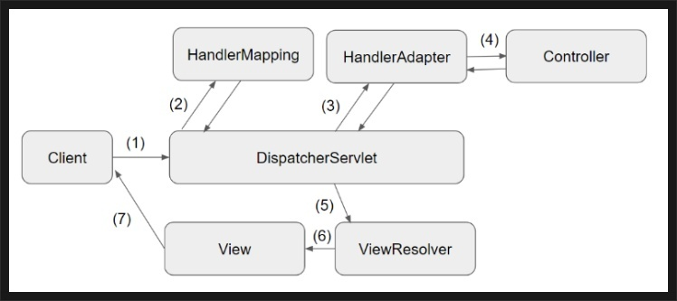
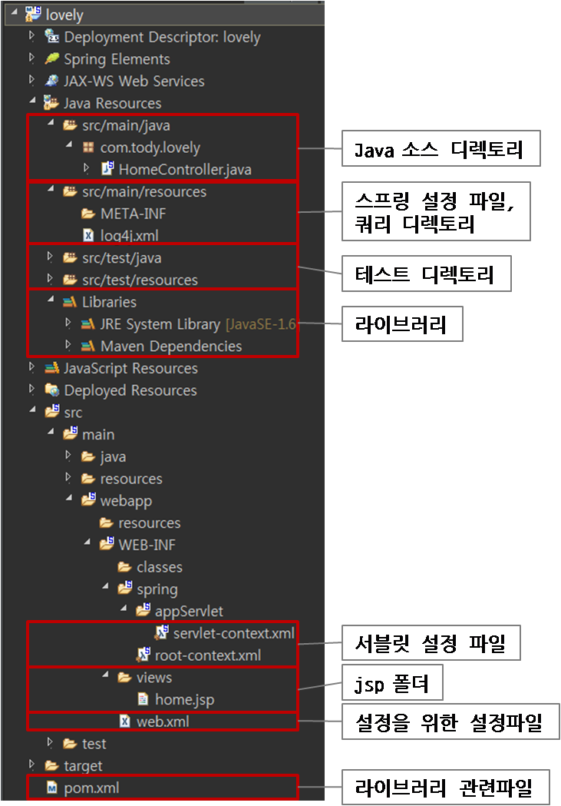

- Table of Contents
{:toc .large-only}

신입 개발자로서 첫 업무는 코드분석이었다. 
처음 프로젝트를 받아보니 우선 내가 뭘하고 있는지도 모를정도 였다. 
생소한 메소드, 함수, 검색을 통해 눈으로 보기만하기엔 
너무 쉽게 잊어 버릴것 같은데 활용까지하기에는 너무나도 방대하였다.
마음을 차분히 다잡고 천천히 흐름을 따라가보기로 하였다.

## Spring 프로젝트 분석하기

내가 분석할 프로젝트는 스프링 mvc 모델이다. mvc의 데이터 흐름대로 따라가 보기로 하였다.

(1)과정 사이 필터  
(2)클라이언트의 요청에 따른 HandlerMapping이 알맞은 Controller  
(3)HandlerMapping에 실행할 Controller의 메서드
(4)Controller의 메서드를 실행하며 service영역에서 비즈니스로직 실행 결과를 Model로서 DispatcherServlet에 반환 
순으로 따라가며 데이터의 흐름을 파악하였다.

## 패키지 구조파악

[이미지출처](https://to-dy.tistory.com/14
사진은 스프링프로젝트를 처음 생성했을때 구조이다.
패키지 구조파악으로 프로젝트의 구조 설계를 파악할 수 있다.
그리고 하나의 프로젝트는 여러 개의 작은 프로젝트들을 모듈로 가져와 사용하기도 한다. 
이러한 요소 역시 패키지 구조 파악을 통해 알 수 있다.
실제로 실무에서 다른 프로젝트에서도 사용할 수 있게 공통 모듈을 만들어 넣고 가져와 쓰기도 하고, 외부의 프로젝트를 필요에 따라 모듈로 가져와 쓰기도 한다고 한다.)

## 빌드 성정 파일을 보기
빌드설정 파일을 보면 어떤 dependency(모듈)을 쓰는지 확인할 수 있다.
gradle로 구축된 프로젝트라면 build.gradle을 보고 maven 으로 구촉된 프로젝트라면 pom.xml을 열어보면 된다.
이를 통해 생소한 함수들이 어떤 모듈인지 파악하는데 도움이 되었다.

## Spring 웹 계층도 파악
프로젝트의 계층도를 그려서 파악하면 흐름 파악에 큰 도움이 된다.
구조파악은 덤이다.

## DB구조 파악
웹개발에서 가장 중요한것은 데이터의 처리라고 생각한다. 테이블 구조(상세정보) 코멘트 확인은 프로젝트를 파악하는데 필수이다. 코드분석의 장점중 하나는 좋은 참고서라는 점이다.
잘 짜여진 sql문을 보는것은 굉장히 좋은 기회이다.

## 마무리
위에 말했듯이 코드분석은 좋은 참고서이다. 신입에게 이러한 업무를 주는것은 
실무적응을 위해서기도 하지만 개발자는 스스로 발전해야한다. 그렇기에 좋은 참고서를 주는 것으로 스스로 발전할수 있는 기회를 주는것이라 생각한다.